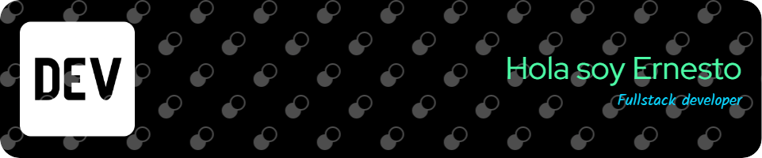

Soy un apasionado desarrollador Fullstack en busca de emocionantes oportunidades para aprender y crecer en el mundo del desarrollo.

* 🖥️  Visita mi portafolio [lernesto](http://lernesto.net)
* ✉️  Puedes contactarme [contacto@lernesto.net](mailto:contacto@lernesto.net)

---

### Conocimientos

---

### Informacion Github

---

### Repositorios

	
	

---

### Redes sociales

 
	<a href="https://www.linkedin.com/in/lernesto" target="_blank" rel="noreferrer"> 
		<picture> 
			<source media="(prefers-color-scheme: dark)" srcset="https://raw.githubusercontent.com/danielcranney/readme-generator/main/public/icons/socials/linkedin-dark.svg" /> 
			<source media="(prefers-color-scheme: light)" srcset="https://raw.githubusercontent.com/danielcranney/readme-generator/main/public/icons/socials/linkedin.svg" /> 
			 
		</picture> 
	</a>

